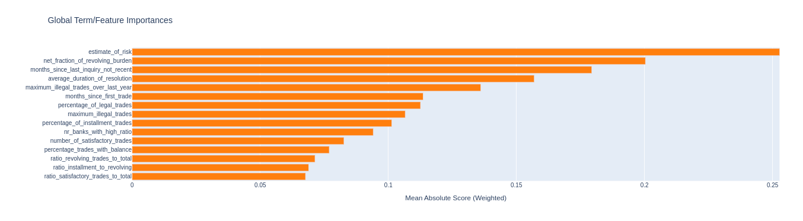
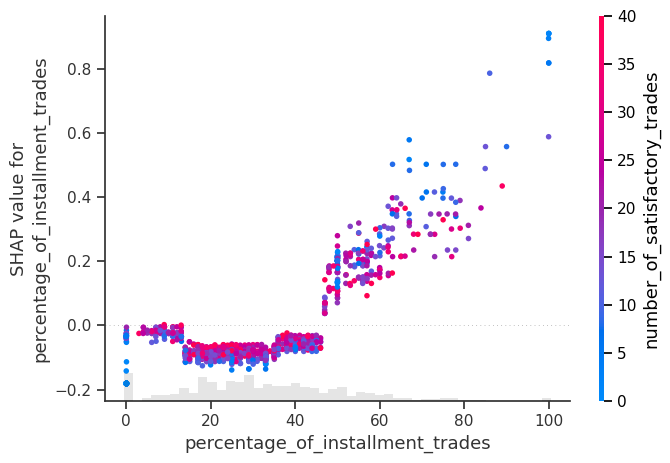
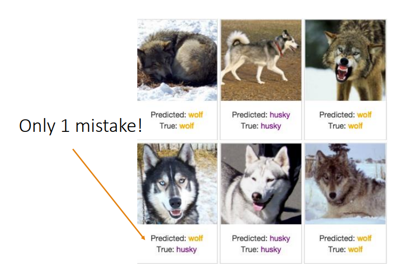

# 
__Introduction to__

Care for data scientists and models

How to set up your organizations 

to be informed by data

Joerg Rings 2024

---

## What is a model

- Takes input data and transforms it through a mathematical/statistical process into an output

---

## Prominent Types of Models

- Supervised (with target): Regression/Classification
- Unsupervised: Clustering
- Reinforcement
- Generative: Large Language Models
- Forecasting

---

## Example: HELOC Dataset

- Is a home loan too risky? (FICO dataset)
- Target: Will loan be paid within 2 years?
- Some features:
  * External estimate of risk
  * Months since first trade
  * Percentage trades with balance

---

## Model Lifecycle 
 __Design__ -- What is the problem?

 __Development__ -- Use math and coding to build a solution

 __Operation__ -- Automate and monitor 

---

## 

_Good/bad news_ \
Being data-driven means \
everyone’s way of work will change.

---

## Model Lifecycle - 1: Design
- Collaborate to find out: 
    - What is the problem the organization wants to solve
    - What analysis have they done
    - What are the levers
    - What decisions will be changed and how are they prepared to do that
    - What data is available
    - Is a model needed to improve decision making?

---

## Model Lifecycle - 1: Design

- Thought Experiment:
- If the data scientists were your superiors, how would you prove to them you know how to change your ways based on data decisions?
- Can you do a small test using a very simplified model?
- Can you set up A/B testing of challenger model against the current baseline process?

---

## Model Lifecycle - 2: Development

- Where all the mathy and engineering happens
- Extract and transform data, engineer feature, fit algorithms
- Analyse and explain outcome
- Define decision process
- Document so it can be reproduced

---

## 

Building a model is advanced data analysis.

It lets your data tell stories.
 
_Don't outsource them, don't rush them._

---

## Example: HELOC Dataset

- Feature importance of [InterpretML Expolainable Boosting Trees

- Will relying on external risk evaluation make our model unstable?

---

## Example: HELOC Dataset

SHAP measures impact of features on results locally or globally

---

## Model Lifecycle - 3: Operation

- Package model (scoring) code to production quality
  * Has to run fully automated
- Document everything so it's reproducible
- Especially, document all assumptions and risks
- Monitor execution; validity and stability over lifetime 
  * Validity: Model parameters still work for the problem
  * Stability: Scored population still looks like training population

---

## Model Risk

---

## Model Risk - Sources of Errors

- Data
- Data
- Method
- Implementation
- Lack of Monitoring
- etc etc etc

--- 

## Successful Data Science: Skills Needed

- Math
- Creativity
- Scientific Rigor
- Communication 
- Software Engineering and DevOps
- Domain Knowledge
- Judgment of "good enough"

---

## Link collection

- https://www.alleghenycounty.us/Services/Human-Services-DHS/DHS-News-and-Events/Accomplishments-and-Innovations/Allegheny-Family-Screening-Tool
- https://web.mit.edu/rudin/www/docs/LethamRuMcMa15.pdf
- http://www.rshroff.com/uploads/6/2/3/5/62359383/predictive_analytics.pdf
- https://oc.acm.org/docs/7-12-2017%20-%20Sameer%20Singh%20-%20Explaining%20Black-Box%20ML%20Predictions.pdf
- https://dl.acm.org/doi/pdf/10.1145/3613904.3641954
- https://arxiv.org/abs/1706.03762 <- I let GitHub Copilot suggested this one

---
